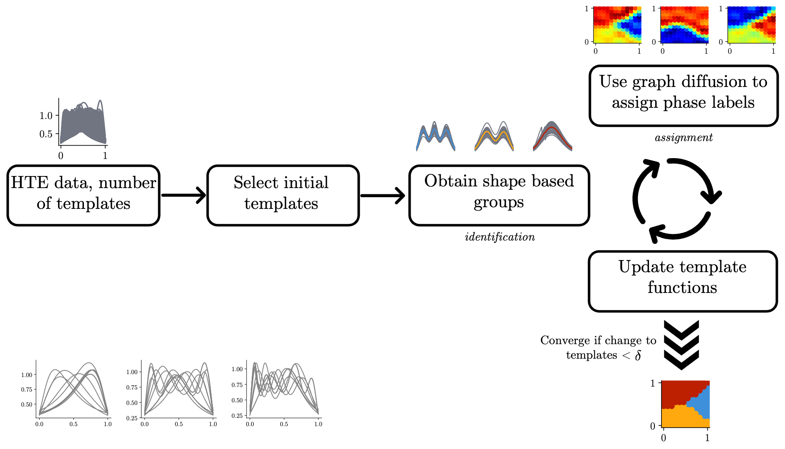

## Automatic Structure Phase Map (autophasemap) generation

This repository host the supporting code for the following paper.
"Metric geometry tools for automatic structure phase map generation" by Kiran Vaddi, Karen Li, and Lilo D Pozzo.

```bibtex
@article{autophasemap, 
	place={Cambridge}, 
 	title={Metric geometry tools for automatic structure phase map generation}, 
 	DOI={10.26434/chemrxiv-2022-3p4gx}, 
 	journal={ChemRxiv}, 
 	publisher={Cambridge Open Engage}, 
 	author={Vaddi, Kiran and Li, Karen and Pozzo, Lilo D}, year={2022}} 
 	This content is a preprint and has not been peer-reviewed.
```



To install the package:

```bash
pip install git+https://github.com/kiranvad/warping.git 
pip install https://github.com/pozzo-research-group/autophasemap.git 
```

A simple example using synthetic Gaussian functions as an example can be found in [this ](/example.ipynb)notebook. This example can be run on your local machine once the `autophasemap` package is installed using similar instructions as above.


